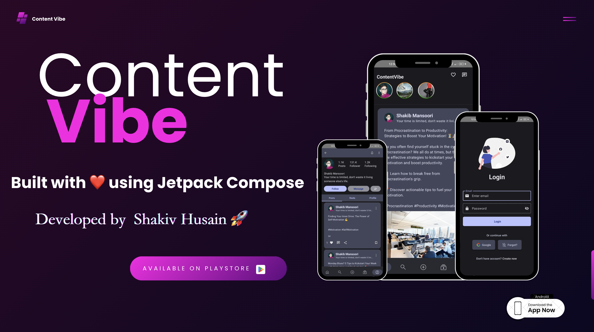

Content Vibe App 🚀
==================

Welcome to **Content Vibe**, where creativity knows no bounds! Our app serves as your ultimate playground for expressing your unique style, sharing your stories, and discovering a vibrant community of diverse creatives.

Join us in celebrating creativity and connection!

**🚧 Work in Progress**

Welcome to the **Now in Android** app repository! This app is a fully functional Android application developed entirely in **Kotlin** and **Jetpack Compose**.

## Purpose

My goal in this journey is to deepen my understanding of **Jetpack Compose** while also contributing to the learning experience of others. By sharing insights and resources, I hope to create a supportive environment where we can all grow and thrive in our Android development skills together.

Feel free to explore and contribute as we continue to enhance this project!

## Built With 🛠

- **Jetpack Compose** 🎨
- **Kotlin** 🦸
- **Clean Architecture** 🏗️
- **Hilt Dependency Injection** 🔌
- **Coroutines** ⏳
- **Design Patterns** 📐

### Additional Technologies

- **Android Jetpack Components** 📦
- **Flow** 🌊
- **Paging 3** 📄
- **Navigation Component** 🧭
- **Data Binding** 🔗
- **Retrofit** 🔄
- **Firebase** ☁️
- **Android SDK** 📱

And more! ✨

## Key Features 🚀

🌟 **Key Features** 🌟

- 🏠 **Home Screen:** Enjoy a vibrant feed where you can explore a variety of posts and connect with the community.

- 📝 **Post Creation:** Share your thoughts and ideas effortlessly by creating posts with engaging text and captivating media.

- 📸 **Stories with Media:** Add a personal touch to your profile by sharing stories that showcase your creativity and experiences.

- 🔑 **Single Tap Login:** Access your account quickly and easily with our streamlined login process.

- 👥 **Discover Creatives:** Immerse yourself in a vibrant community of diverse creators. Explore user profiles, forge new connections, and find fellow creatives who resonate with your vibe.

## Download 📥
- Download latest APK from [Click Here](https://drive.google.com/file/d/1aBTZeAOG2MzuNwVPwTT1_hlKLxClx_W3/view)

## Architecture 🗼

This project follows the famous Clean architecture and best practices from Google's
[GithubBrowserSample](https://github.com/android/architecture-components-samples/tree/master/GithubBrowserSample)

## Requirements 🎯 
- Android 7.0 and Above
- Min sdk version 24

## Permissions 💻
- Internet

